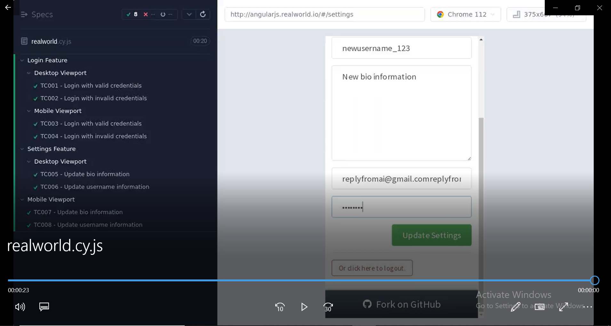

# Conduit
ConduitTest
TASK 2: TEST AUTOMATION

Please create automated tests for Conduit: http://angularjs.realworld.io/#/. The automated
tests should contain tests for the login feature and the settings feature of the app.
Requirements:
· We’d like to see this task using Cypress, that you can access
here: https://www.cypress.io
· As the app is responsive website the test should run with desktop (viewport width: 1280,
viewportHeight: 800) and mobile simulator (viewport width: 375, viewportHeight: 667);
· The tests should run at least with Chrome;
· Please provide instructions for installation and running tests

-------------------------------------------------------------------------------------
1. Automated the given website with cypress.
2. As asked automated in both desktop and mobile with view port dimensions as given.
3. The tests are configured to execute in chrome-browser.
4. Created a workflow file with Github Actions to run in a CI/CD pipeline which contains steps to insatll the dependencies and to run the tests.
5. I am installing dependencies npm and then using the cypress Github Actions I am running the tests by passing cypress run as a command in my package.json.
6. To make sure the results are visible and accessible I am uploading the results(video) as artifact using "upload artifact Github Actions" and the test results are also displayed in the workflow execution(https://github.com/akhilasreenavya/Conduit-cypress/actions/runs/4780424868).

